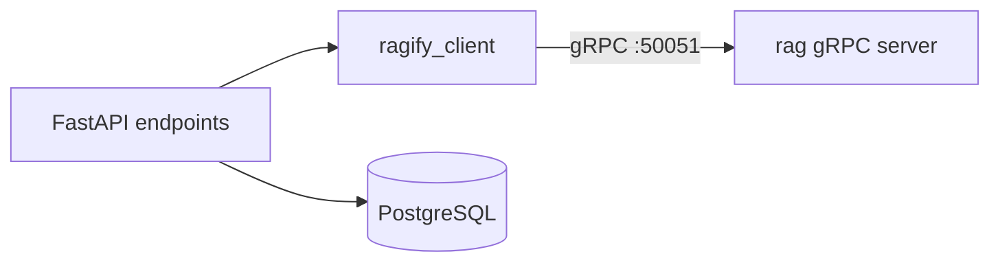

# ragify-api-python

FastAPI backend for Ragify. It owns auth, workspaces, uploads and chat sessions, persists them to PostgreSQL, and delegates all AI work (ingestion, retrieval, generation) to the `rag` gRPC server. There is no AI/ML code in this service.

## Stack

- FastAPI + uvicorn
- SQLAlchemy 2 (async) + asyncpg
- Alembic migrations
- gRPC client (`grpcio`) via `src/ragify_client`
- JWT auth (PyJWT) + bcrypt

## Run

```bash
uv sync
.venv/bin/python -m alembic upgrade head
.venv/bin/python -m uvicorn main:app --host 0.0.0.0 --port 8000
```

or `./run.sh dev`. Requires PostgreSQL (see repo root `docker compose` / `make infra-up`) and the rag gRPC server on `RAGIFY_GRPC_ENDPOINT` (default `localhost:50051`) for workspace/upload/query features.

## Endpoints

All routes are prefixed with `/api/v1`. `auth/register` and `auth/login` are public; everything else needs `Authorization: Bearer <jwt>`.

| Method | Path | Description |
| --- | --- | --- |
| `POST` | `/auth/register` | Register a user |
| `POST` | `/auth/login` | Login, returns `access_token` |
| `GET` | `/auth/session` | Current user |
| `GET` / `POST` | `/workspaces/` | List / create workspaces |
| `GET` / `PATCH` / `DELETE` | `/workspaces/{id}` | Get / update / delete a workspace |
| `POST` | `/workspaces/{id}/upload` | Upload files (multipart) |
| `GET` | `/workspaces/{id}/uploads/{status_id}` | Poll upload status |
| `POST` | `/workspaces/{id}/query` | Chat query (proxies `RagService.Query`) |
| `GET` | `/workspaces/{id}/sessions` | List sessions |
| `GET` / `PATCH` / `DELETE` | `/workspaces/{id}/sessions/{session_id}` | Session messages / rename / delete |
| `DELETE` | `/workspaces/{id}/sessions` | Delete all sessions |

## Data model

- `users` (id, name, email, password hash)
- `workspaces` (id, user_id, name, description, tags, materials)
- `sessions` (id, workspace_id, name, messages JSONB)
- `upload_statuses` (id, workspace_id, user_id, status, files, logs)

Migrations live in [`alembic/versions/`](alembic/versions).

## Talking to rag

`src/ragify_client` mirrors the rag gRPC surface with a lazy, reconnecting channel:

```python
from src.ragify_client.vector_store import vector_store_manager
from src.ragify_client.ingestion import ingest_document, process_section
from src.ragify_client.query import builder

vector_store_manager.create_collection("42")   # VectorStoreService.CreateCollection
chunks = process_section(["paragraph one", "paragraph two"])  # IngestionService.ProcessSection
builder.invoke({"messages": [{"role": "user", "content": "hi"}], "workspace_id": 42})
```



## Configuration

Read from the root `.env`: `DATABASE_URL`, `JWT_SECRET`, `JWT_EXPIRES_MINUTES`, `CORS_ORIGINS`, `RAGIFY_GRPC_ENDPOINT`.
